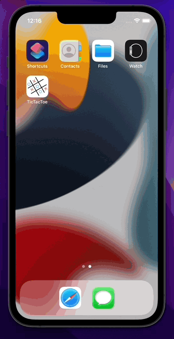
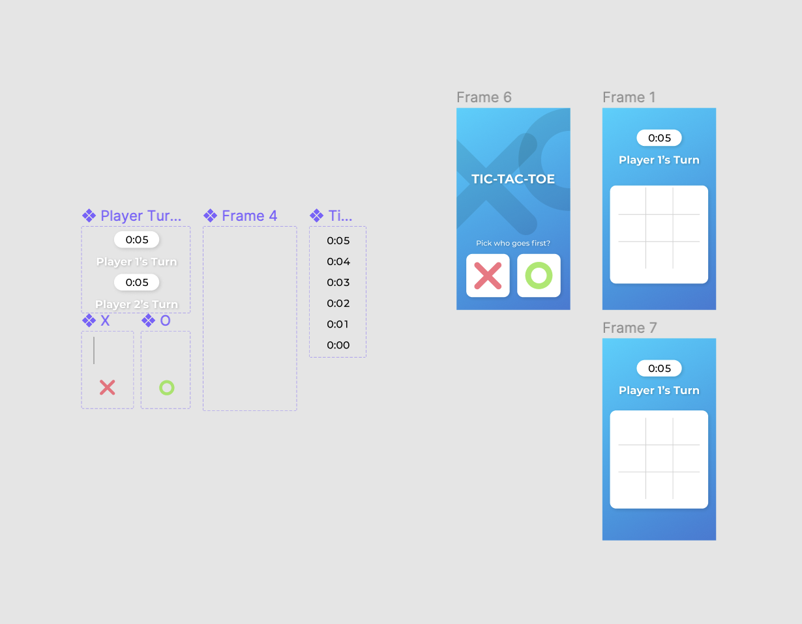
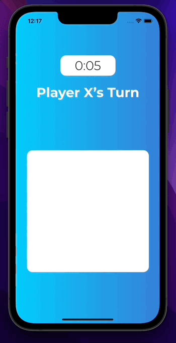
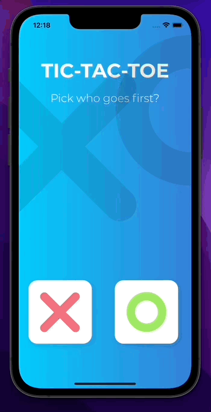
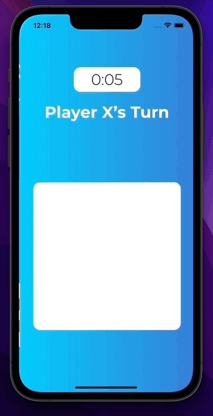

# CryptoPiggyBank
TicTacToe game made with [Figma](https://www.figma.com/community/file/950288920087501966) design.  

## Demo

 

## Description

This app was made from the Figma design linked above to imitate the app development process.  
The game contains total of 3 screen's:

choosing type
game screen with a place to put your tile
result screen where we can see if we won or no
I have tried to code this UI with applied few changes

 

## Game
As in a real TicTacToe game users have to place his/her tile on the grid.  
If the user has 3 the same tiles in row/column/diagonal he/she win another case if CPU does the same user loses.  
Here are presented all options:

### User wins
  

### User lose
  

### Draft
  

## Room for improvements

In a future version of the app, I will add multiplayer mode.

